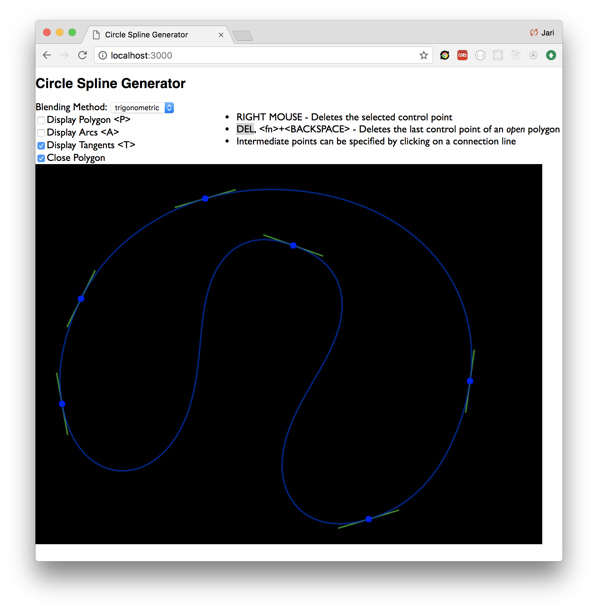

# circle-spline
Interactive circle spline generator based on [this][cspline] publication.

Features:
- linear, parabolic, cubic, trigonometric weighting functions
- add new control points at the end
- add a new control point in between two existing control points
- removal of a control point by right-clicking on it
- positioning of a control point by dragging
- toggle the visibility of the polygon, tangents and arcs
- closable control polygon to generate a cyclic / periodic Circle Spline

Example of a periodic Circle Spline:

# Running the program
First, install [Parcel][parcel-bundler] bundler:

<code>
npm i -g parcel-bundler
</code>

then,

<code>
npm run dev
</code>

Now, open <code>http://localhost:3000</code> in your browser.

# Running the tests

<code>
npm run test
</code>

[cspline]: http://citeseerx.ist.psu.edu/viewdoc/download?doi=10.1.1.87.3282&rep=rep1&type=pdf
[parcel-bundler]: https://parceljs.org/
[mocha-babel-es6]: http://jamesknelson.com/testing-in-es6-with-mocha-and-babel-6/
